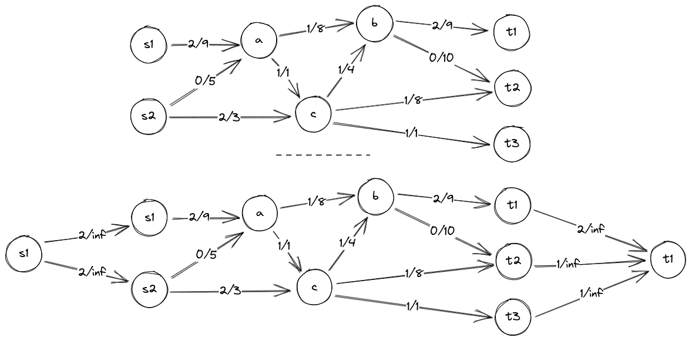

# heimaverkefni 8

ef við ímyndum okkur að við höfum hnúta 
$s_0$ og 
$t_0$ þar sem rými úr 
$s_0$ og rými inn í 
$t_0$ eru bæði 
$\infty$

tengjum núna þessa nýju hnúta við þá sem voru upphaflega í flæðisnetinu það mun þá líta svona út:  

nú erum við búin að leysa kjarna vandans, að vera með marga $s$ og $t$ hnúta

þessi aðferð virkar líka fyrir net sem hafa hnúta sem eru bæði upphafs og endahnútar á sama tíma, við þurfum samt að bæta við einu skrefi til að það virki  
fyrir alla hnúta V sem eru bæði upphafs- og endahnútar skiptum við þeim upp í tvennt, fyrir hnút $V_i$ yrði skiptingin $SV_i$ og $TV_i$ þar sem flæðið á milli leggjana ákvarðaðist af $w_i$